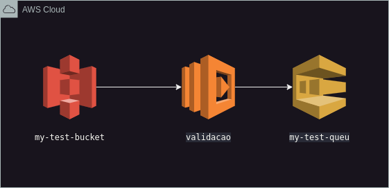

# ValidateFileAWSLambda

Este aplicativo Java é um AWS Lambda destinado a validar arquivos CSV carregados em um bucket do Amazon S3. Ele processa os arquivos CSV em busca de erros de formatação e, em seguida, envia informações sobre pessoas encontradas nos arquivos para uma fila do Amazon SQS.

## Pré-requisitos

Antes de executar este aplicativo, certifique-se de ter o seguinte:

- Java Development Kit (JDK) instalado em seu sistema.
- Credenciais da conta AWS configuradas.
- Gradle instalado.

## Configuração

Certifique-se de que as seguintes configurações estejam corretas no arquivo `App.java`:

- **Configuração do Endpoint Localstack:**
    - O aplicativo está atualmente configurado para usar o Localstack para desenvolvimento/testes locais. Atualize a configuração do endpoint (`http://s3.us-east-1.localhost.localstack.cloud:4566`) com o endpoint do seu Amazon S3 se você não estiver usando o Localstack.

- **URL da Fila SQS:**
    - O aplicativo esta atualmente configurado com variável `QUEUE` com a URL da sua fila SQS.
    - (`http://sqs.us-east-1.localhost.localstack.cloud:4566/000000000000/my-test-queue`)

## Docker Compose
Para simplificar o ambiente de desenvolvimento local, você pode usar o Docker Compose para executar o Localstack e configurar serviços como o S3 e o SQS. Adicione um arquivo docker-compose.yml à pasta do projeto com as configurações necessárias.
Abra terminal na pasta localstack localizada ValidateFileAWSLambda/localstack/docker-compose.yml para simular o ambiente da AWS, para melhor entendimento vc pode acessar endpoint https://docs.localstack.cloud/overview/
```bash
docker compose up 
```

## Executando o Aplicativo

Para executar o aplicativo:

1. Clone ou baixe o repositório para sua máquina local.
2. Abra o terminal na pasta: 'ValidateFileAWSLambda/localstack' execute o comando 'docker compose up'
```bash
docker compose up 
```
3. Abra outro terminal e execute os seguntes comandos
```bash
# criando bucket s3 e fila sqs
aws --endpoint-url=http://localhost:4566 s3 mb s3://my-test-bucket
aws --endpoint-url=http://localhost:4566 sqs create-queue --queue-name my-test-queue
# subindo arquivo para execucao da lambda
aws --endpoint-url=http://localhost:4566 s3  cp ./localstack/mock_data.csv s3://my-test-bucket
```
4. Navegue até o diretório do projeto.
5. Execute o seguinte comando para compilar e executar o aplicativo:

```bash
./gradlew run 
```


## Uso
Faça o upload de um arquivo CSV para o bucket S3 especificado.
O aplicativo será acionado automaticamente e processará o arquivo enviado.
As informações do arquivo CSV serão analisadas e enviadas para a fila SQS configurada.

## Monitoramento
O aplicativo registra eventos e erros usando o logging SLF4J. Você pode monitorar a execução do aplicativo visualizando os logs.

## Configuração do Logger
O aplicativo utiliza o SLF4J para registro de eventos e erros. Certifique-se de configurar adequadamente o logger de acordo com suas preferências e requisitos de monitoramento.


## Diagrama




